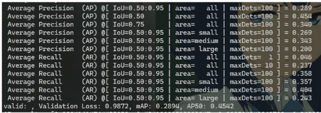
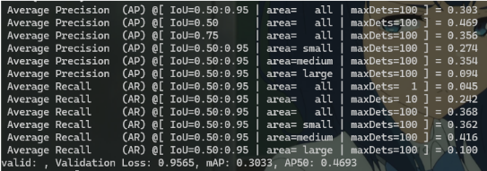

# Visual-Recognition-using-Deep-Learning-HW3

### StudentID: 313553046
### Name: 馬國維

## Introduction
In this assignment, we have an instance segmentation task. We need to detect objects and segment each instance at the pixel level. For this assignment, I use a Mask-RCNN model with a ResNet50 backbone and Feature Pyramid Network(FPN) for feature extraction.

## How to install
1. git clone https://github.com/seeadragon/Visual-Recognition-using-Deep-Learning-HW3

2. pip install -r requirements.txt
3. python main.py

## Usage
### modify in main.py
### For training
main.py: model.train_model()
### For evaluating
main.py: model.valid()
### For testing
main.py: model.test()

## config
config = {
        'num_classes': 5,
        'device': 'cuda' if torch.cuda.is_available() else 'cpu',
        'num_epochs': 50,
        'batch_size': 1,
        'learning_rate': 1e-4,
        'weight_decay': 5e-5,
        'optimizer': optim.AdamW,
        'log_dir': 'log/maskrcnn_eval',
    }

## Hardware Specifications
CPU: 12th Gen Intel(R) Core(TM) i5-12400F  
GPU: NVIDIA GeForce RTX 3050

## Result

